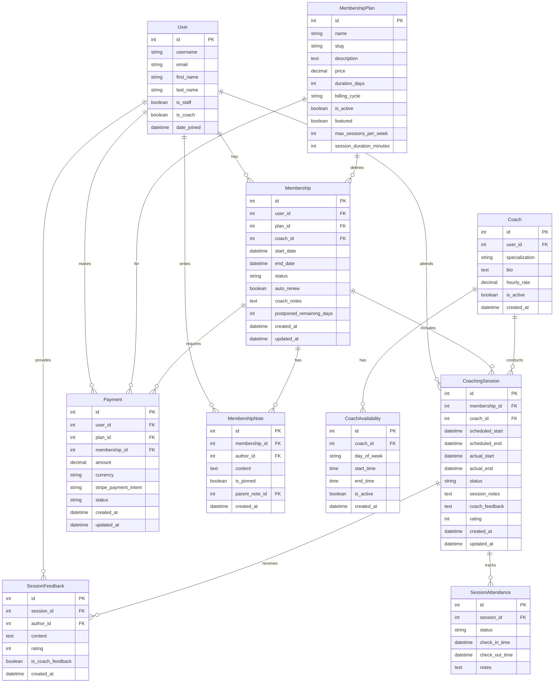
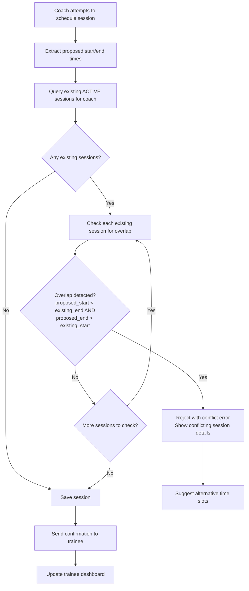
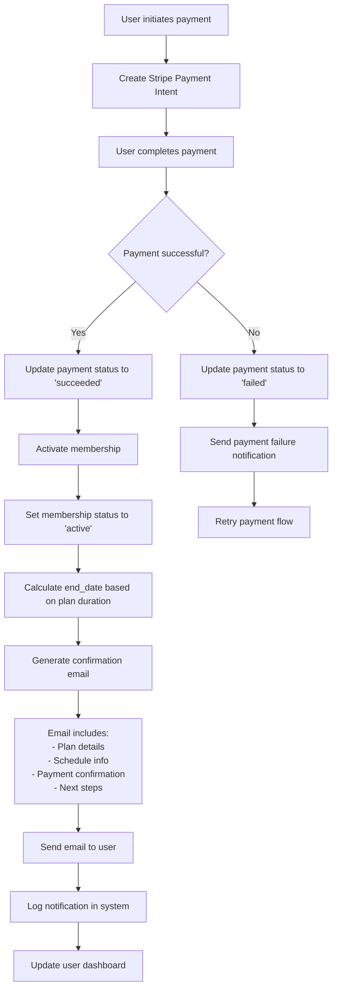
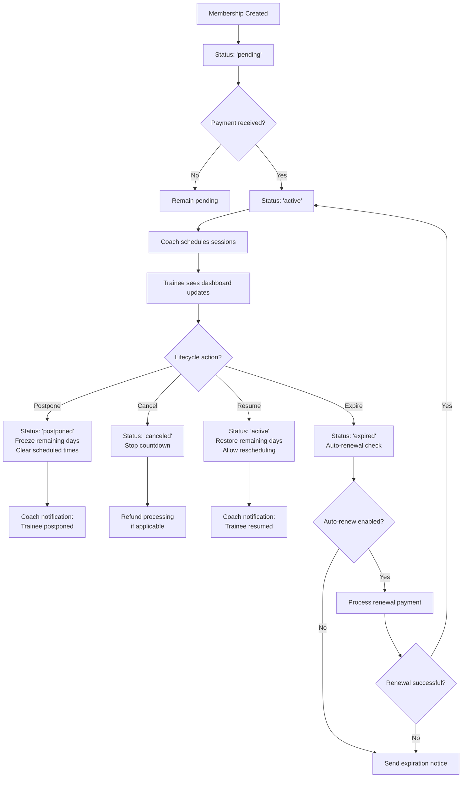

# Coaching Management System Design

## 1. Enhanced Database Schema (ERD)

### Core Entities and Relationships



## 2. API Endpoint Structure

### Authentication & Authorization
- All endpoints require authentication
- Coach-specific endpoints require `is_staff=True` or `is_coach=True`
- Users can only access their own data unless they're coaches/staff

### Core API Endpoints

#### Membership Management
```
GET    /api/memberships/                    # List user's memberships
GET    /api/memberships/{id}/               # Get membership details
POST   /api/memberships/                    # Create new membership
PUT    /api/memberships/{id}/               # Update membership
DELETE /api/memberships/{id}/               # Cancel membership
POST   /api/memberships/{id}/postpone/      # Postpone membership
POST   /api/memberships/{id}/resume/        # Resume postponed membership
```

#### Session Management
```
GET    /api/sessions/                       # List sessions (filtered by user/coach)
GET    /api/sessions/{id}/                  # Get session details
POST   /api/sessions/                       # Schedule new session
PUT    /api/sessions/{id}/                  # Update session
DELETE /api/sessions/{id}/                  # Cancel session
POST   /api/sessions/{id}/reschedule/       # Reschedule session
POST   /api/sessions/{id}/checkin/          # Check-in to session
POST   /api/sessions/{id}/checkout/         # Check-out from session
```

#### Coach Management
```
GET    /api/coaches/                        # List available coaches
GET    /api/coaches/{id}/                   # Get coach details
GET    /api/coaches/{id}/availability/      # Get coach availability
POST   /api/coaches/{id}/availability/      # Set coach availability
PUT    /api/coaches/{id}/availability/{av_id}/ # Update availability slot
DELETE /api/coaches/{id}/availability/{av_id}/ # Remove availability slot
GET    /api/coaches/{id}/schedule/          # Get coach's schedule
```

#### Communication & Feedback
```
GET    /api/memberships/{id}/notes/         # Get membership notes/comments
POST   /api/memberships/{id}/notes/         # Add note/comment
PUT    /api/notes/{id}/                     # Update note
DELETE /api/notes/{id}/                     # Delete note
POST   /api/notes/{id}/pin/                 # Pin/unpin note

GET    /api/sessions/{id}/feedback/         # Get session feedback
POST   /api/sessions/{id}/feedback/         # Add session feedback
PUT    /api/feedback/{id}/                  # Update feedback
```

#### Payment & Notifications
```
POST   /api/payments/                       # Create payment intent
POST   /api/payments/{id}/confirm/          # Confirm payment
GET    /api/payments/                       # List user payments
POST   /api/notifications/send/             # Send notification (coach only)
```

## 3. Logic Flowcharts

### A. Session Scheduling Logic (Conflict Prevention)



### B. Payment Processing & Automation Flow



### C. Membership Lifecycle Management



## 4. Enhanced Models Implementation

The enhanced models will include:

1. **Coach Model**: Extends User with coaching-specific fields
2. **CoachingSession Model**: Manages individual training sessions
3. **CoachAvailability Model**: Defines when coaches are available
4. **SessionFeedback Model**: Bi-directional feedback system
5. **Enhanced MembershipNote Model**: Threaded comments with pinning
6. **SessionAttendance Model**: Check-in/check-out tracking

## 5. Key Features Implementation

### Automated Conflict Prevention
- Server-side validation in `CoachingSession.clean()`
- Real-time availability checking via API
- Conflict resolution suggestions

### Trainee Transparency Dashboard
- Real-time session updates
- Payment status tracking
- Progress visualization
- Communication history

### Dynamic Lifecycle Management
- State machine for membership status
- Automated notifications for state changes
- Flexible rescheduling with conflict prevention

### Transactional Automation
- Webhook integration with Stripe
- Automated email generation
- Payment confirmation workflows

### Interactive Feedback Loop
- Threaded comment system
- Pinned coach directives
- Real-time messaging interface
- Context-aware notifications

## 6. Security & Performance Considerations

- Row-level security for data access
- Optimized queries with select_related/prefetch_related
- Caching for frequently accessed data
- Rate limiting on API endpoints
- Input validation and sanitization
- CSRF protection for state-changing operations